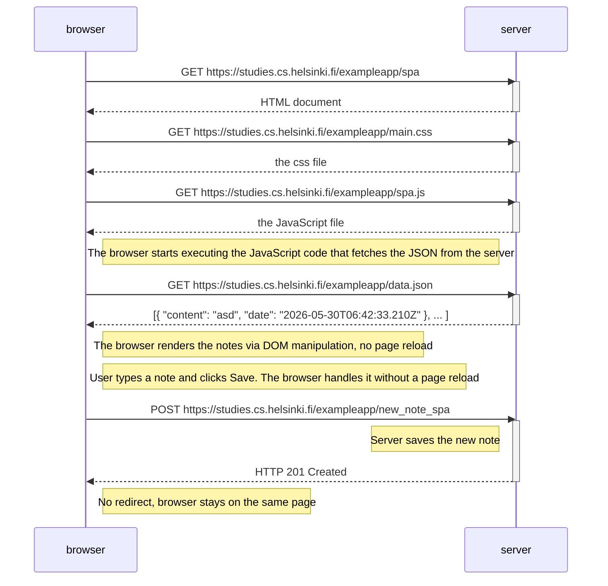

## SPA New Note

```mermaid
sequenceDiagram
    participant browser
    participant server

    browser->>server: GET https://studies.cs.helsinki.fi/exampleapp/spa
    activate server
    server-->>browser: HTML document
    deactivate server

    browser->>server: GET https://studies.cs.helsinki.fi/exampleapp/main.css
    activate server
    server-->>browser: the css file
    deactivate server

    browser->>server: GET https://studies.cs.helsinki.fi/exampleapp/spa.js
    activate server
    server-->>browser: the JavaScript file
    deactivate server

    Note right of browser: The browser starts executing the JavaScript code that fetches the JSON from the server

    browser->>server: GET https://studies.cs.helsinki.fi/exampleapp/data.json
    activate server
    server-->>browser: [{ "content": "asd", "date": "2026-05-30T06:42:33.210Z" }, ... ]
    deactivate server

    Note right of browser: The browser renders the notes via DOM manipulation, no page reload

    Note right of browser: User types a note and clicks Save. The browser handles it without a page reload

    browser->>server: POST https://studies.cs.helsinki.fi/exampleapp/new_note_spa
    activate server
    Note left of server: Server saves the new note
    server-->>browser: HTTP 201 Created
    deactivate server

    Note right of browser: No redirect, browser stays on the same page
```
